## Una foto, dos fases que fallan distinto {#problema}

:::: {.columns}
::: {.column width="34%"}
<div class="lienzo" style="aspect-ratio: 3 / 4; width: min(100%, 400px);">
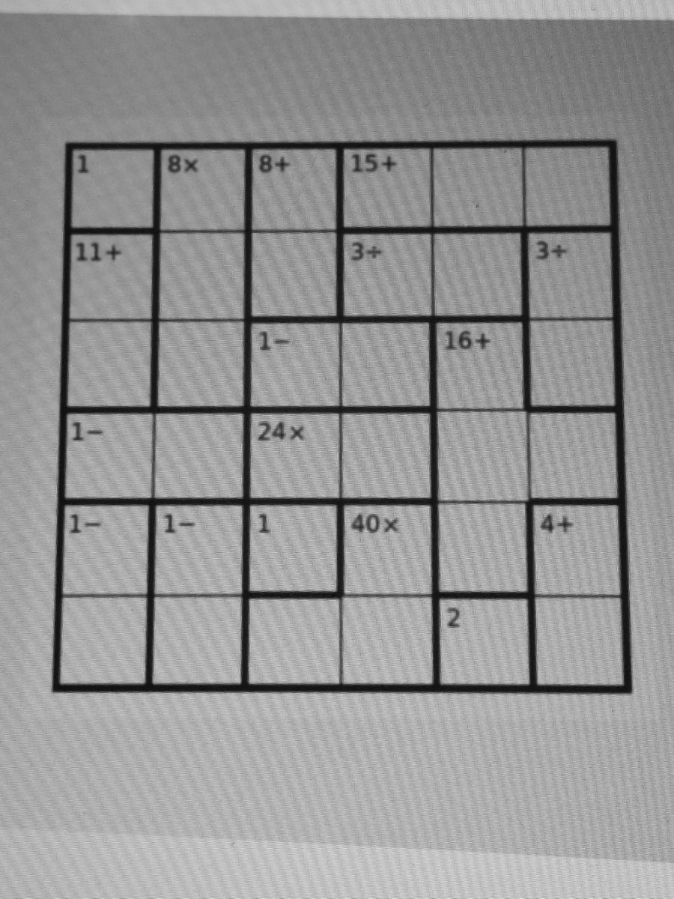
</div>
[Foto real, tomada con el celular a una pantalla.]{.nota}
:::

::: {.column width="62%"}
[Resolver un KenKen desde una foto]{.eyebrow}

:::: {.columns}
::: {.column width="49%"}
::: {.card .naranja-borde}
[Percibir]{.titulo}

[Tamaño, jaulas y etiquetas. Falla como falla una foto: luz, perspectiva, un ÷ que parece +.]{.suave}
:::
:::
::: {.column width="49%"}
::: {.card .indigo-borde}
[Razonar]{.titulo}

[Un modelo de restricciones en CP-SAT. Exacto sobre la instancia que recibe.]{.suave}
:::
:::
::::

<br>

::: {.cita .naranja .fragment}
Si la visión lee un **5** donde hay un **6**, el solver resuelve con exactitud **el puzzle equivocado**.
:::

::: {.fragment}
[¿Qué sobrevive a una lectura equivocada?]{.titulo .indigo}
:::
:::
::::

::: {.notes}
**Rody.** Abrir con la foto: es real, la tomamos con el celular a la pantalla. El KenKen es un cuadrado latino con jaulas aritméticas. Resolverlo desde una foto son dos problemas distintos que fallan distinto. El solver es exacto, pero sobre lo que recibe: si la visión lee un 5 por un 6, resuelve perfecto el puzzle equivocado. Esa es la pregunta del trabajo.
:::

## Leer bien el 97% de las etiquetas es acertar 7 de cada 10 tableros {#compuesto}

:::: {.columns}
::: {.column width="62%"}
<div class="lienzo solo" data-viz="compuesto" data-label="Probabilidad de leer un tablero completo según cuántas etiquetas tiene"></div>
<div class="leyenda"><span><i style="background:var(--indigo)"></i>KenKen: 97.09% por etiqueta (este trabajo)</span><span><i style="background:var(--neutro)"></i>Sudoku: 99% por celda (Mulamba et al., 2024)</span></div>
:::
::: {.column width="36%"}
<ol class="pasos">
<li class="fragment"><strong>Si los errores fueran independientes</strong>, un tablero con <em>k</em> etiquetas sale entero con p<sup>k</sup>.</li>
<li class="fragment"><strong>Lo medido</strong> en 70 tableros reales sigue la curva: 48 de 70 salen enteros.<span class="nota">Los 9×9 tienen ~30 etiquetas y aciertan 3 de 7.</span></li>
<li class="fragment"><strong>El sudoku lo confirma:</strong> 99% por celda es 44% por tablero.</li>
<li class="fragment"><strong>No basta con leer mejor.</strong> Hay que verificar lo leído.</li>
</ol>
:::
::::

::: {.notes}
**Rody.** Este es el porqué del trabajo. 97% por etiqueta suena muy bien, pero un tablero tiene unas 12 etiquetas y basta una mal leída. Si los errores fueran independientes, la curva dice que acertaríamos unos 7 de cada 10 tableros; medimos 48 de 70. Mulamba y otros (KU Leuven) muestran lo mismo en sudoku: 99% por celda es 44% por tablero. Conclusión: no vamos a llegar a leer perfecto, así que el sistema tiene que saber cuándo leyó mal. La curva es una estimación con errores independientes, no está en el informe como resultado.
:::

## La visión y el solver solo se hablan a través de la instancia {#arquitectura}

<div class="lienzo solo" data-viz="arquitectura" data-label="Arquitectura: app, nodo, Fase 1, instancia, Fase 2 y sus tres salidas"></div>

::: {.r-stack .chica .suave}
[**1 ·** La app toma la foto y la envía en JSON. `adb reverse` la lleva por USB o Wi-Fi a la PC, sin abrir puertos.]{.fragment .fade-in-then-out}

[**2 ·** El nodo de cómputo (FastAPI) atiende `POST /resolver` en el puerto 8723.]{.fragment .fade-in-then-out}

[**3 ·** La Fase 1 reconstruye el tablero sin aprendizaje: tamaño, jaulas y etiquetas.]{.fragment .fade-in-then-out}

[**4 ·** La instancia es el contrato: lo único que la Fase 2 llega a ver.]{.fragment .fade-in-then-out}

[**5 ·** CP-SAT resuelve y cuenta soluciones, con tope de dos.]{.fragment .fade-in-then-out}

[**6 ·** Con una, se devuelve. Con ninguna, el solver intenta reparar la lectura. Con varias, se rechaza.]{.fragment .fade-in-then-out}

[**7 ·** La respuesta vuelve a la app: estado, solución, correcciones y dónde cae cada celda en la foto.]{.fragment}
:::

::: {.notes}
**Rody.** Recorrer el diagrama paso a paso. La idea clave es el contrato: la visión entrega una instancia (tamaño y lista de jaulas con operación y objetivo) y el solver no ve nada más. Eso es lo que nos permite usar al solver como verificador: solo una solución única vuelve al usuario. Pasar la palabra a Jorge para la Fase 1.
:::

## Sin aprendizaje: la foto se endereza con una homografía {#fase1-foto}

[Fase 1 · Visión]{.eyebrow}

:::: {.columns}
::: {.column width="64%"}
<div class="lienzo-par" data-viz="fase1-foto" style="display:grid; grid-template-columns: 3fr 4fr; gap: 18px; align-items: center;">
<div class="lienzo" style="aspect-ratio: 3 / 4;">

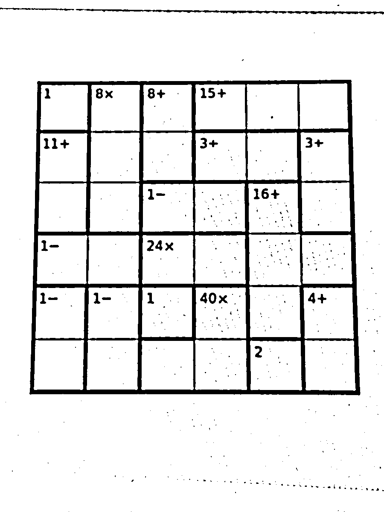
</div>
<div class="lienzo" style="aspect-ratio: 1;">
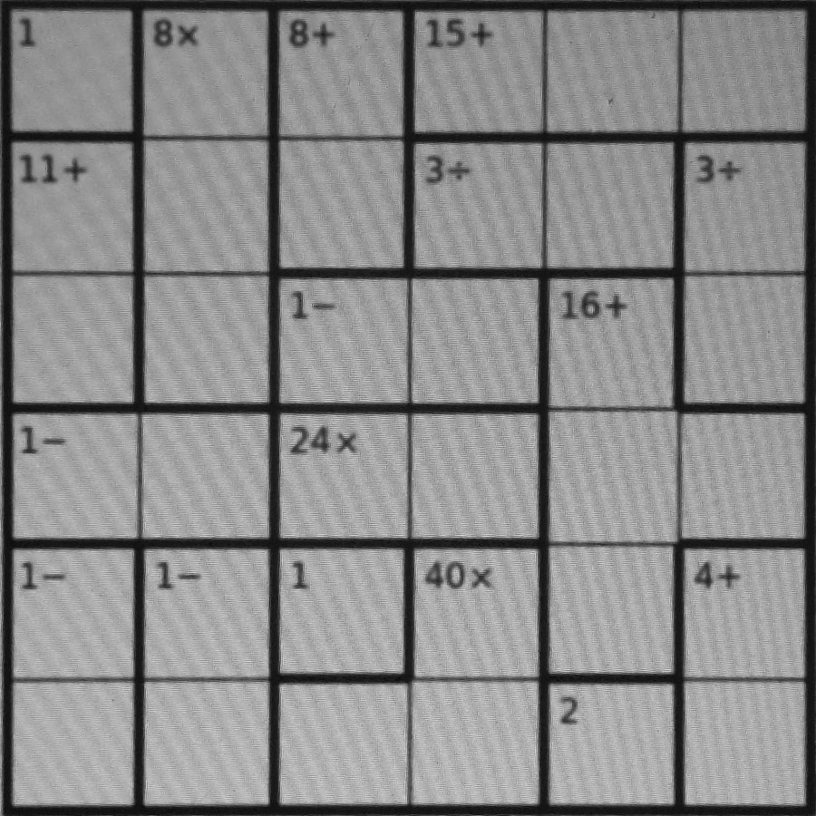
</div>
</div>
:::
::: {.column width="34%"}
<ol class="pasos">
<li class="fragment"><strong>Umbral adaptativo.</strong> La tinta queda separada aunque la luz no sea pareja.</li>
<li class="fragment"><strong>El contorno externo mayor</strong> se aproxima por un cuadrilátero: cuatro esquinas.</li>
<li class="fragment"><strong>Homografía.</strong> Las esquinas enderezan el tablero a 900 × 900 px.</li>
<li class="fragment"><strong>Todo lo demás</strong> trabaja sobre esa imagen, nunca sobre la foto.</li>
</ol>
:::
::::

::: {.notes}
**Jorge.** Toda la Fase 1 es visión clásica con OpenCV, sin entrenar nada. Primero binarizamos con umbral adaptativo, que aguanta luz desigual. Del contorno externo más grande sacamos un cuadrilátero y con sus cuatro esquinas una homografía que deja el tablero cuadrado. Desde aquí todo trabaja sobre esa imagen rectificada; la homografía inversa la usamos al final para dibujar la solución sobre la foto.
:::

## El tamaño sale de la periodicidad, no de líneas completas {#fase1-n}

[Fase 1 · Visión]{.eyebrow}

:::: {.columns}
::: {.column width="64%"}
<div class="lienzo solo" data-viz="fase1-n" data-label="Perfil de tinta de las líneas verticales y las líneas que predice cada tamaño"></div>
:::
::: {.column width="34%"}
<ol class="pasos">
<li class="fragment"><strong>Perfil de tinta</strong> de los trazos verticales largos, columna por columna.</li>
<li class="fragment"><strong>Con n = 4</strong> se predicen líneas donde no hay tinta: la más débil queda en cero.</li>
<li class="fragment"><strong>Con n = 6</strong> todas las líneas predichas existen.</li>
<li class="fragment"><strong>n = 3 también pasa</strong>: es divisor. Se elige el mayor n con todas sus líneas.</li>
</ol>
[Toca cualquier n para probarlo.]{.nota .fragment}
:::
::::

::: {.notes}
**Jorge.** En un KenKen impreso la línea fina se corta donde la atraviesa una jaula, así que no podemos exigir líneas completas. Lo que se conserva es la periodicidad. Para cada n candidato predecimos dónde caen las líneas y miramos la más débil: con el n correcto todas tienen tinta, con uno equivocado alguna cae en blanco. Los divisores también pasan (3 explica la mitad de las líneas de un 6), por eso nos quedamos con el mayor. Si alguien pregunta, se puede tocar cada n en vivo.
:::

## Las jaulas se separan por el grosor de cada arista {#fase1-jaulas}

[Fase 1 · Visión]{.eyebrow}

:::: {.columns}
::: {.column width="40%"}
<div class="lienzo" data-viz="fase1-jaulas" style="aspect-ratio: 1; max-width: 470px;">

</div>
:::
::: {.column width="58%"}
<div class="lienzo solo" data-viz="fase1-grosor" data-label="Grosor medido de las 60 aristas interiores"></div>
<ol class="pasos">
<li class="fragment"><strong>Mediana del ancho del trazo</strong> en cada una de las 60 aristas interiores.</li>
<li class="fragment"><strong>Dos anchos de pluma:</strong> la distribución es bimodal y Otsu la corta sola.</li>
<li class="fragment"><strong>Gruesa = borde de jaula.</strong> Unión-búsqueda junta el resto: 17 jaulas.</li>
</ol>
:::
::::

::: {.notes}
**Jorge.** Conocida la rejilla, sabemos dónde está cada arista y basta medir su grosor. Tomamos la mediana del ancho del trazo más cercano, que ignora los cruces y los dígitos. El puzzle se imprime con dos plumas, así que los grosores son bimodales y el método de Otsu pone el umbral. Pasar el mouse por un punto marca su arista en el tablero. Las celdas que no separa un borde grueso se agrupan con unión-búsqueda.
:::

## Las etiquetas se leen por correlación con plantillas {#fase1-etiquetas}

[Fase 1 · Visión]{.eyebrow}

<div class="recortes" data-viz="recortes">
<div class="recorte">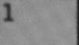<div class="leido">1</div></div>
<div class="recorte">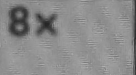<div class="leido">8×</div></div>
<div class="recorte">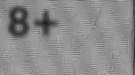<div class="leido">8+</div></div>
<div class="recorte">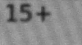<div class="leido">15+</div></div>
<div class="recorte">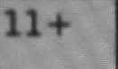<div class="leido">11+</div></div>
<div class="recorte mal">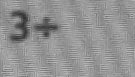<div class="leido">3+</div></div>
<div class="recorte mal">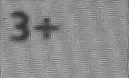<div class="leido">3+</div></div>
<div class="recorte">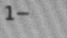<div class="leido">1−</div></div>
<div class="recorte">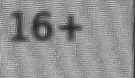<div class="leido">16+</div></div>
<div class="recorte">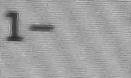<div class="leido">1−</div></div>
<div class="recorte">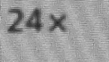<div class="leido">24×</div></div>
<div class="recorte">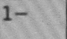<div class="leido">1−</div></div>
<div class="recorte">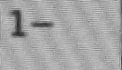<div class="leido">1−</div></div>
<div class="recorte">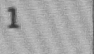<div class="leido">1</div></div>
<div class="recorte">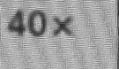<div class="leido">40×</div></div>
<div class="recorte">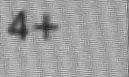<div class="leido">4+</div></div>
<div class="recorte">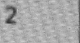<div class="leido">2</div></div>
</div>

[Los 17 recortes reales de la foto, con lo que leyó la visión debajo.]{.nota}

:::: {.columns}
::: {.column width="49%"}
[Cada carácter se compara por **correlación normalizada** con plantillas en siete tipografías. El ÷ son tres manchas que se reagrupan.]{.chica}
:::
::: {.column width="49%"}
::: {.fragment}
[Aquí, los puntos del ÷ se fundieron con la barra. **La visión leyó 3+ dos veces.** Nada en la Fase 1 puede saberlo.]{.chica .naranja-t}
:::
:::
::::

::: {.notes}
**Jorge.** La etiqueta va en la esquina superior izquierda de la celda ancla. La recortamos con un margen que se mide, no fijo (un margen fijo cortaba los dígitos y era el peor error del pipeline). Separamos caracteres por componentes conexas y los comparamos con plantillas por correlación normalizada. En esta foto pasó algo: los puntos del ÷ se fundieron con la barra y leímos 3+ dos veces. La instancia es válida, pasa el contrato. Nada en la visión puede darse cuenta. Devolver a Rody.
:::

## El modelo cabe en una pantalla y no conoce ningún tablero {#modelo}

[Fase 2 · Programación con restricciones]{.eyebrow}

:::: {.columns}
::: {.column width="64%"}
```{.python code-line-numbers="|3-4|5-8|9-14|15-20"}
def construir_modelo(inst):
    n, m = inst.size, cp_model.CpModel()
    x = [[m.NewIntVar(1, n, f"x{r}{c}") for c in range(n)]
         for r in range(n)]
    # cuadrado latino: 2n restricciones globales
    for i in range(n):
        m.AddAllDifferent(x[i])
        m.AddAllDifferent([x[j][i] for j in range(n)])
    # una restricción por jaula
    for k, jaula in enumerate(inst.cages):
        v, T = [x[r][c] for r, c in jaula.cells], jaula.target
        if jaula.op == "=":   m.Add(v[0] == T)
        elif jaula.op == "+": m.Add(sum(v) == T)
        elif jaula.op == "*": m.AddMultiplicationEquality(T, v)
        else:  # − y ÷: el orden de las celdas no importa
            M = m.NewIntVar(1, n, f"M{k}")
            mi = m.NewIntVar(1, n, f"m{k}")
            m.AddMaxEquality(M, v)
            m.AddMinEquality(mi, v)
            m.Add(M - mi == T if jaula.op == "-" else M == T * mi)
    return m, x
```
[`kenken_cp/solver.py`, condensado. Lo escribió el equipo, sin asistencia de IA.]{.nota}
:::
::: {.column width="34%"}
[$x_{i,j} \in \{1,\dots,n\}$]{.chica}

[`AllDifferent` por fila y columna: $2n$ restricciones globales.]{.chica}

[Jaulas: $=$, $\sum$, $\prod$ y, para $-$ y $\div$, el par $\max/\min$: simétrico y sin booleanos.]{.chica}

::: {.callout-note appearance="minimal"}
El modelo es $O(n^2)$, pero completar un cuadrado latino ya es NP-completo. En la práctica, la propagación basta: ningún tablero real ramifica.
:::
:::
::::

::: {.notes}
**Rody.** Este es el modelo completo. Variables de 1 a n por celda. AllDifferent por fila y columna. Una restricción por jaula: igualdad, suma lineal, la multiplicación global de CP-SAT, y para resta y división el par max/min, que no depende del orden en que la visión lista las celdas y no necesita booleanos. Para la división basta max = T·min: con enteros positivos el cociente es exacto. El modelo no tiene ningún dato de un tablero: sirve para cualquier n y cualquier partición. Lo escribimos nosotros sin IA (lo declaramos en el informe).
:::

## Contar soluciones convierte al solver en verificador {#verificador}

[Fase 2 · Programación con restricciones]{.eyebrow}

[Un puzzle publicado tiene **solución única**. Así que contamos, con tope de dos, y cada resultado dice algo de la visión:]{.suave}

:::: {.columns}
::: {.column width="32%"}
::: {.card .indigo-borde .fragment}
[1]{.cierre .indigo}

[Una solución]{.titulo}

[La lectura es consistente. **Se devuelve.**]{.suave .chica}
:::
:::
::: {.column width="32%"}
::: {.card .naranja-borde .fragment}
[0]{.cierre .naranja-t}

[Ninguna]{.titulo}

[El solver **demuestra** que algo se leyó mal. **Se intenta reparar.**]{.suave .chica}
:::
:::
::: {.column width="32%"}
::: {.card .neutro-borde .fragment}
[≥ 2]{.cierre .suave}

[Varias]{.titulo}

[La lectura no basta para decidir. **Se rechaza**, en llano.]{.suave .chica}
:::
:::
::::

<br>

```{.python}
contar_soluciones(instancia, tope=2)   # enumerate_all_solutions + StopSearch al llegar a 2
```

::: {.notes}
**Rody.** Este es el giro del trabajo. Como un puzzle publicado tiene solución única, el número de soluciones es una prueba sobre la lectura. Una: se devuelve. Cero: el solver demuestra que la visión se equivocó, y ahí entra la reparación. Dos o más: no hay base para decidir, se rechaza. Contar con tope de dos cuesta, en el peor caso, una búsqueda completa más.
:::

## Para resolver no hace falta reificar; para reparar, sí {#reparar-modelo}

[Reparación guiada por el solver]{.eyebrow}

:::: {.columns}
::: {.column width="60%"}
```{.python code-line-numbers="|2-3|4-8|10-12|13|15-16"}
for k, (jaula, cands) in enumerate(zip(inst.cages, opciones)):
    lits = []  # cands: lo leído (peso 0) y alternativas
    for j, (op, t, w) in enumerate(cands):
        ell = m.NewBoolVar(f"l{k}_{j}")
        if   op == "+": m.Add(suma == t).OnlyEnforceIf(ell)
        elif op == "*": m.Add(prod == t).OnlyEnforceIf(ell)
        elif op == "-": m.Add(M - mi == t).OnlyEnforceIf(ell)
        elif op == "/": m.Add(M == t * mi).OnlyEnforceIf(ell)
        lits.append(ell)
        if j > 0:  # primero cambios; luego, plausibilidad
            cambios.append(ell)
            peso.append((100 + w) * ell)
    m.AddExactlyOne(lits)

m.Add(sum(cambios) <= max_cambios)
m.Minimize(sum(peso))
```
[`kenken_cp/reparar.py`, condensado.]{.nota}
:::
::: {.column width="38%"}
$$\ell_{k,c} \Rightarrow \textit{jaula}_k(c) \qquad \textstyle\sum_c \ell_{k,c} = 1$$

<ol class="pasos">
<li><strong>Candidatas a un glifo:</strong> ÷ ↔ +, 5 ↔ 6… con el peso de lo que observamos fallar.</li>
<li><strong>Un literal por candidata</strong> y exactamente una por jaula.</li>
<li><strong>Mínimo de cambios</strong>; a igual número, la más plausible.</li>
<li><strong>Se acepta solo si</strong> ninguna otra corrección con un cambio más lleva a otro tablero y la solución es única.</li>
</ol>
:::
::::

::: {.notes}
**Rody.** Para resolver no reificamos nada (medimos: la disyunción reificada rinde igual que max/min). Para reparar sí: es el uso natural de la reificación, decidir qué lectura creer. Cada jaula tiene su lectura y alternativas a un glifo de distancia, cada una con un literal booleano que activa su restricción; exactamente una por jaula. Minimizamos cuántas lecturas cambian y, a igual número, la menos plausible según los fallos observados (5 leído como 6 pesa 1, + leído por ÷ pesa 2). La regla de aceptación es la que evita errores silenciosos; la vemos en dos diapositivas.
:::

## En la foto real, el solver encontró los dos ÷ que la visión leyó como + {#reparar-foto}

:::: {.columns}
::: {.column width="44%"}
<div class="lienzo" data-viz="reparar-foto" style="aspect-ratio: 3 / 4; width: min(100%, 430px);">

</div>
:::
::: {.column width="54%"}
[Reparación guiada por el solver]{.eyebrow}

<ol class="pasos">
<li class="fragment"><strong>La visión lee 17 jaulas</strong> y la instancia cumple el contrato.</li>
<li class="fragment"><strong>Dos dicen 3+.</strong> En el papel dicen 3÷.</li>
<li class="fragment"><strong>CP-SAT demuestra que no tiene solución</strong>, sin ramificar.</li>
<li class="fragment"><strong>Prueba las candidatas</strong> de cada jaula: solo una corrección cierra el tablero.</li>
<li class="fragment"><strong>Solución única</strong>, dibujada sobre la propia foto con la homografía inversa.</li>
</ol>
<div class="candidatas" data-viz="candidatas"></div>
:::
::::

::: {.notes}
**Rody.** Este es el caso real de la app. La foto era del tablero de la figura del informe, a la pantalla. La visión leyó 3+ en dos jaulas que eran 3÷. La instancia es válida, pero el solver demuestra en milisegundos que no tiene solución. Entonces prueba las alternativas: 3÷ (peso 2), 8+ (peso 3), 3× (peso 4). La única corrección que deja solución única es cambiar las dos a ÷. La app lo dice y marca las jaulas corregidas. Pasar a José para la evaluación.
:::

## La verdad sale del propio PDF {#datos}

[Evaluación]{.eyebrow}

::: {.numeros}
::: {.numero}
[72]{.n}

[tableros reales de KrazyDad: 48 de 4×4, 16 de 6×6 y 8 de 9×9]{.t}
:::
::: {.numero}
[895]{.n}

[etiquetas, cada una con su verdad exacta]{.t}
:::
::: {.numero}
[5]{.n}

[cuadernillos: dos para desarrollar, tres que nadie miró]{.t}
:::
::: {.numero}
[0]{.n .naranja}

[etiquetas puestas a mano]{.t}
:::
::::

<br>

:::: {.columns}
::: {.column width="58%"}
[Los PDF son **vectoriales**: cada etiqueta está como texto con su caja. Proyectada con la homografía del tablero, da su celda. La celda sale de la geometría, no del detector, así que el detector **no se mide contra sí mismo**.]{.chica}
:::
::: {.column width="40%"}
::: {.callout-note appearance="minimal"}
KrazyDad autoriza el uso escolar y prohíbe el comercial. Los PDF se descargan bajo demanda y no se redistribuyen.
:::
:::
::::

::: {.notes}
**José.** No encontramos un dataset público y etiquetado de KenKen, así que lo armamos. Scrapeamos cinco cuadernillos de KrazyDad y, como los PDF son vectoriales, el texto de cada etiqueta trae su posición: la proyectamos con la homografía y obtenemos la celda. Verdad exacta sin etiquetar nada a mano. Separamos dos cuadernillos de desarrollo (6H, 9H) y tres que no usamos para ajustar nada (4E, 4H, 6E).
:::

## El error no se reparte: 21 de los 26 fallos son un 5 leído como 6 {#waffle}

[Evaluación · lectura de etiquetas]{.eyebrow}

<div class="lienzo solo" data-viz="waffle" data-label="Cada cuadrado es una etiqueta real; los fallos se marcan por tipo"></div>
<div class="leyenda"><span><i class="cuadro" style="background:var(--rejilla)"></i>bien leída</span><span><i class="cuadro" style="background:var(--naranja)"></i>un 5 leído como 6</span><span><i class="cuadro" style="background:var(--suave)"></i>otro fallo (3 ilegibles de cuatro cifras, 6×→8×, 288×→286×)</span></div>

::: {.r-stack .chica .suave}
[**97.09%** de 895 etiquetas, κ de Cohen 0.969: «casi perfecto».]{.fragment .fade-in-then-out}

[En los cuadernillos que nadie miró, **96.45%** (p = 0.24 frente a desarrollo). Pero el fallo cambia: **16 de sus 17 errores son 5+ → 6+**.]{.fragment}
:::

::: {.notes}
**José.** Cada cuadrado es una etiqueta real. Leemos bien el 97.09%, con kappa 0.969. Lo interesante es que el error no se reparte: 21 de 26 fallos son un 5 leído como 6, y en los cuadernillos que no usamos para desarrollar, 16 de 17 son la etiqueta 5+ leída como 6+, muy común en 4×4. La diferencia entre los dos conjuntos no es significativa (Fisher, p = 0.24), pero el modo de fallo dominante solo apareció en datos que nadie miró. Los tres ilegibles son etiquetas de cuatro cifras que desbordan la celda.
:::

## Ningún tablero mal leído produce una solución errónea {#e2e}

[Evaluación · de punta a punta]{.eyebrow}

:::: {.columns}
::: {.column width="66%"}
<div class="lienzo solo" data-viz="e2e" data-label="Los 70 tableros reales: cómo se leyeron y qué devolvió el sistema"></div>
<div class="leyenda"><span><i style="background:var(--indigo)"></i>bien leído</span><span><i style="background:var(--naranja)"></i>sin solución</span><span><i style="background:var(--indigo); box-shadow: 0 0 0 3px var(--naranja)"></i>reparado</span><span><i style="background:var(--neutro)"></i>rechazado o abstención</span></div>
:::
::: {.column width="32%"}
<ol class="pasos">
<li class="fragment"><strong>70 tableros con verdad</strong>, de 4×4 a 9×9.</li>
<li class="fragment"><strong>48 se leen bien</strong> de punta a punta.</li>
<li class="fragment"><strong>De los 22 mal leídos</strong>, 3 se rechazan antes del solver y en 19 el solver demuestra que no hay solución.</li>
<li class="fragment"><strong>La reparación recupera 16 de 19</strong> y se abstiene en 3.</li>
<li class="fragment"><strong>Cero soluciones erróneas.</strong></li>
</ol>
:::
::::

::: {.notes}
**José / Rody.** Cada punto es un tablero. 48 de 70 se leen bien completos. Los otros 22 no llegan nunca a una solución equivocada: 3 se rechazan por una etiqueta ilegible, y en 19 el solver demuestra que lo leído no tiene solución. La reparación devuelve la solución verdadera en 16 y se abstiene en 3. Resultado: 64 resueltos bien, 6 sin respuesta, cero errores silenciosos. Dato extra: el solver también encontró un error en nuestra verdad (un 9×9 cuyo PDF perdió una jaula de división); contado estricto, 47 de 70.
:::

## La regla que evita errores silenciosos salió de un error {#margen}

[Reparación · pruébalo]{.eyebrow}

:::: {.columns}
::: {.column width="62%"}
::: {.content-visible unless-profile="autonomo"}
```{ojs}
//| output: false
function segmentado(rotulo, opciones, inicial) {
  const raiz = document.createElement("div");
  const et = document.createElement("span");
  et.className = "control"; et.textContent = rotulo;
  const grupo = document.createElement("div");
  grupo.className = "segmentado";
  raiz.append(et, grupo);
  raiz.value = inicial;
  for (const op of opciones) {
    const b = document.createElement("button");
    b.textContent = op;
    b.setAttribute("aria-pressed", op === inicial);
    b.onclick = () => {
      raiz.value = op;
      grupo.querySelectorAll("button").forEach(x => x.setAttribute("aria-pressed", x === b));
      raiz.dispatchEvent(new Event("input", {bubbles: true}));
    };
    grupo.append(b);
  }
  return raiz;
}
```

```{ojs}
viewof cambios = segmentado("cambios máximos", [1, 2, 3], 3)
viewof margen = segmentado("margen", [0, 1], 1)
```

```{ojs}
lienzoMargen = {
  const div = document.createElement("div");
  div.className = "lienzo solo";
  return div;
}
```

```{ojs}
//| output: false
window.KK.margen(lienzoMargen, cambios, margen)
```
:::

::: {.content-visible when-profile="autonomo"}
<div data-viz="margen"></div>
:::
:::
::: {.column width="36%"}
[Las 19 lecturas reales sin solución, reparadas con distintos parámetros.]{.chica .suave}

[La primera versión aceptaba la corrección mínima si era única de su tamaño (**margen 0**). En un 4×4 con dos 5+ leídos como 6+, **arreglar uno solo ya cerraba el tablero**, pero con otra solución.]{.chica}

[Ahora se exige que ninguna corrección con **un cambio más** lleve a otro tablero. Si dos explicaciones son casi igual de plausibles, el nodo **se abstiene**.]{.chica}
:::
::::

::: {.notes}
**Rody.** Esta diapositiva es interactiva (Observable dentro de Quarto). Cambiar el margen a 0 y mostrar el cuadrado rojo: es el error silencioso real que encontramos al medir. Con margen 1 desaparece, a cambio de dos abstenciones más en algunos parámetros. Con 3 cambios máximos y margen 1, que es lo que usa el nodo: 16 bien, 3 abstenciones, 0 errores. Preferimos rechazar a inventar.
:::

## Las restricciones globales hacen el trabajo: cero ramas {#formulaciones}

[Fase 2 · ¿qué aporta cada decisión del modelo?]{.eyebrow}

:::: {.columns}
::: {.column width="66%"}
<div class="lienzo solo" data-viz="formulaciones" data-label="Ramas de búsqueda por tablero con AllDifferent y con desigualdades binarias"></div>
<div class="leyenda"><span><i style="background:var(--indigo)"></i>AllDifferent (este trabajo)</span><span><i class="cuadro" style="background:var(--suave)"></i>desigualdades binarias x ≠ y</span></div>
:::
::: {.column width="32%"}
<ol class="pasos">
<li class="fragment"><strong>Con AllDifferent</strong>, la propagación en la raíz fija las n² celdas en los 70 tableros. Ni una rama.</li>
<li class="fragment"><strong>Con x ≠ y</strong> el modelo dice lo mismo pero propaga menos: 6 de 7 tableros de 9×9 buscan, hasta 5 883 ramas.</li>
</ol>

::: {.fragment}
[9×9, mediana: **7.7 ms → 81.9 ms**. Diez veces más.]{.chica}

[Las 19 lecturas sin solución también se refutan sin ramificar.]{.nota}
:::
:::
::::

::: {.notes}
**Rody.** Medimos tres formulaciones con un solo hilo para que las ramas sean comparables. Con AllDifferent, ningún tablero real ramifica: la propagación hace todo. Reemplazar cada AllDifferent por sus desigualdades binarias dice lo mismo, pero propaga menos y los 9×9 llegan a 5 883 ramas. La versión reificada de resta y división rinde igual que max/min (6.9 vs 7.7 ms): la reificación no cuesta ni aporta para resolver. Esto conecta directo con lo del curso: restricciones globales y propagación.
:::

## Un conjunto sintético es un mal juez de la precisión {#sintetico}

[Evaluación]{.eyebrow}

:::: {.columns}
::: {.column width="64%"}
<div class="lienzo solo" data-viz="sintetico" data-label="Instancia completa bien leída en tableros sintéticos y reales"></div>
:::
::: {.column width="34%"}
<ol class="pasos">
<li class="fragment"><strong>Sintéticos:</strong> verdad gratis y condiciones de foto. Guiaron el diseño.</li>
<li class="fragment"><strong>Reales:</strong> 48 de 70. Por debajo de todos.</li>
</ol>

::: {.fragment}
[El pipeline falló en los 16 primeros tableros reales: la rejilla se interrumpe, la tinta no cae en el píxel predicho, un margen fijo cortaba los dígitos y KrazyDad imprime glifos que el banco no tenía.]{.chica .suave}
:::
:::
::::

::: {.notes}
**José / Rody.** El generador sintético fue clave para desarrollar, pero sobreestima: con tipografías del banco lee bien el 97.8% de tableros limpios; en los reales, 48 de 70. Cuatro supuestos que el generador nunca puso a prueba aparecieron el primer día con tableros reales. Por eso las cifras que valen son las de los tableros reales y, entre ellas, las de los cuadernillos no usados.
:::

## La app muestra lo que el solver decidió, incluida la corrección {#app}

[Integración]{.eyebrow}

<div class="app-fila">
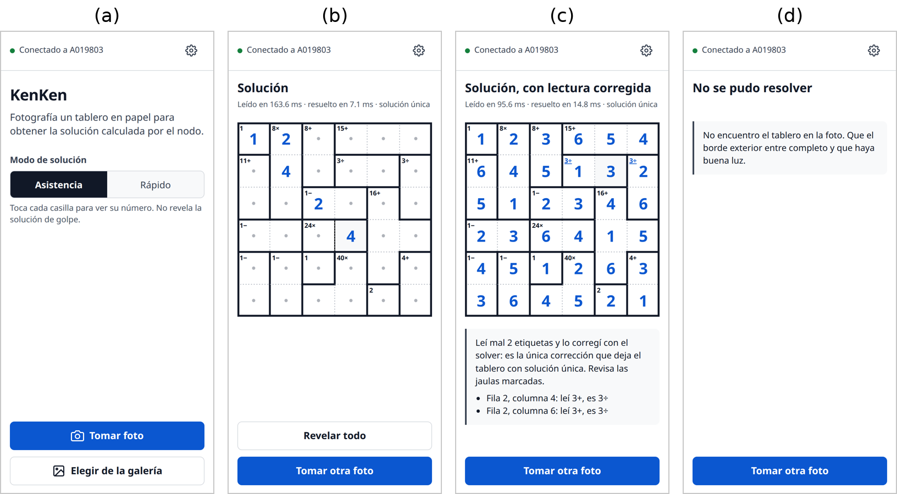
<ol class="pasos app-pasos">
<li><strong>(a) Inicio:</strong> estado del nodo y modo.</li>
<li><strong>(b) Asistencia</strong>, por defecto: el tablero sin números; revelas solo la casilla que tocas.</li>
<li><strong>(c) Reparado:</strong> la app lo dice y marca las jaulas corregidas.</li>
<li><strong>(d) Sin tablero:</strong> lo dice en llano y pide otra foto.</li>
</ol>
</div>

::: {.notes}
**Jorge.** La app (Capacitor, Android) envía la foto al nodo y recibe estado, jaulas, solución, correcciones y un mensaje en llano. Modo Asistencia por defecto: el tablero aparece sin números y revelas casilla por casilla, para no arruinar el puzzle. Modo Rápido: la solución completa, en rejilla limpia o encima de tu foto. Cuando el nodo repara, lo dice; cuando se abstiene, muestra lo que leyó y pide otra foto. La usabilidad todavía no está evaluada con usuarios.
:::

## Demo: de la foto a la solución {#demo background-color="#15161D"}

:::: {.columns}
::: {.column width="56%"}
[En vivo]{.eyebrow}

<ol class="pasos">
<li><strong>Foto</strong> con el Pixel, a un KenKen impreso o en pantalla.</li>
<li><strong>Nodo</strong> en la laptop: <code>uv run python -m kenken_nodo</code></li>
<li><strong>Conexión</strong>: <code>adb reverse tcp:8723 tcp:8723</code></li>
<li><strong>Modo Rápido</strong> → «Sobre tu foto».</li>
</ol>

<br>

[Leerlo y resolverlo tomó **111 ms**.]{.cierre style="font-size:1.3em"}
:::
::: {.column width="42%" .centro}
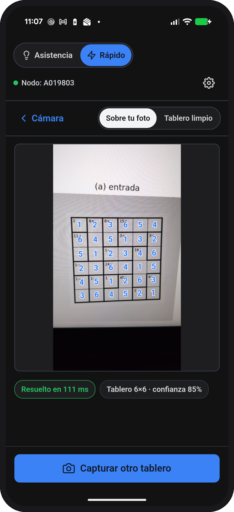
:::
::::

::: {.notes}
**Jorge + Rody.** Antes de la clase: cable USB, `adb devices`, `adb reverse tcp:8723 tcp:8723`, nodo levantado (`cd labs/tb1-kenken && uv run python -m kenken_nodo`). Para que todos vean el celular: `scrcpy` refleja la pantalla en la laptop. Tomar la foto a un tablero impreso o a la diapositiva 2. Mostrar Modo Rápido «Sobre tu foto». Si la foto sale mal, mejor: la app explica por qué y se repite. Plan B si falla el celular: esta captura es real, sin retoques.
:::

## Separar percepción y razonamiento nos dio un verificador {#conclusiones}

:::: {.columns}
::: {.column width="32%"}
::: {.card .indigo-borde}
[La visión clásica lee bien]{.titulo}

[97.09% de 895 etiquetas sin aprendizaje. Su error se concentra en un par de glifos.]{.suave .chica}
:::
:::
::: {.column width="32%"}
::: {.card .indigo-borde}
[El solver verifica y repara]{.titulo}

[Contar soluciones frenó los 22 tableros mal leídos. La reificación reparó 16 de 19. Cero errores silenciosos.]{.suave .chica}
:::
:::
::: {.column width="32%"}
::: {.card .naranja-borde}
[Lo sintético no basta]{.titulo}

[Sirvió para construir. Las cifras que valen son las de tableros reales que nadie miró.]{.suave .chica}
:::
:::
::::

<br>

::: {.fragment}
[El solver no solo resuelve el puzzle: es el control de calidad de lo que la visión cree haber leído.]{.cierre style="font-size:1.25em"}
:::

::: {.notes}
**Rody.** Tres ideas. La visión sin aprendizaje funciona y su error es predecible. El solver, además de resolver en milisegundos sin ramificar, verifica y repara: ningún tablero mal leído llegó a una solución errónea, y de paso encontró un error en nuestra propia verdad. Y el conjunto sintético sirvió para construir, no para medir. Limitaciones (en el apéndice): un solo editor y tipografía, PDF rasterizados en vez de fotos, y cero errores silenciosos es un resultado sobre 22 tableros, no una garantía.
:::

## ¿Preguntas? {#cierre background-color="#15161D"}

:::: {.columns}
::: {.column width="62%"}
[Rody Vilchez · José Villanueva · Jorge Garcia]{.suave}

<br>

[Código: [github.com/R0SEWT/cs-topics](https://github.com/R0SEWT/cs-topics), en `labs/tb1-kenken`]{.chica}

[Informe y fotos: release **TB1 - KenKen**]{.chica}

[Estas diapositivas: [kenken.rosewt.dev](https://kenken.rosewt.dev)]{.chica}

[Dataset de fotos: [huggingface.co/datasets/rosewt/kenken-tb1-fotos](https://huggingface.co/datasets/rosewt/kenken-tb1-fotos)]{.chica}

<br>

[Usamos IA generativa (Claude Code) en el andamiaje de la visión, los scripts de medición, el informe y estas diapositivas. El modelo de CP lo escribió el equipo. Todas las cifras salen de scripts del repositorio y el equipo las revisó.]{.nota}
:::
::: {.column width="36%" .centro}
<div class="qr">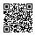</div>

[Release con el informe en PDF]{.nota}
:::
::::

::: {.notes}
Abrir preguntas. Si piden detalle: el apéndice tiene limitaciones, la comparación con Tesseract y otros OCR, y los tiempos del solver.
:::

## Limitaciones {#limitaciones visibility="uncounted"}

[Apéndice]{.eyebrow}

1. Los 70 tableros son de **un solo editor y una tipografía** (Helvetica; el banco tiene un clon). No miden tipografías desconocidas.
2. Son **PDF rasterizados**: tinta real, sin sombras, curvatura ni desenfoque. Lo fotográfico solo lo cubre el sintético.
3. **Cero soluciones erróneas** es un resultado sobre 22 tableros mal leídos, no una garantía: una lectura equivocada que deje otro puzzle válido y único pasaría.
4. Las etiquetas de **cuatro cifras** que desbordan su celda se rechazan antes del solver.
5. Las 16 reparaciones son sobre **19 tableros de un editor**. Falta reparar ilegibles, lecturas con varias soluciones y ponderar con la confianza del clasificador (inferencia conjunta, Mulamba et al.).

## Plantillas y Tesseract empatan; los demás no leen operadores {#ocr visibility="uncounted"}

[Apéndice · 412 etiquetas del conjunto de desarrollo (%)]{.eyebrow}

| Método | Etiqueta | Operación | Número |
|:--|--:|--:|--:|
| **Plantillas (este trabajo)** | **98.8** | **99.3** | **98.8** |
| Tesseract 5.3.4 | 97.1 | 97.8 | 97.8 |
| RapidOCR (PP-OCR) | 64.8 | 68.4 | 94.2 |
| TrOCR base printed | 60.9 | 63.6 | 95.1 |

[Plantillas frente a Tesseract: discrepan en 11 etiquetas, 9 a favor de las plantillas (McNemar, p = 0.065). Al menos uno de los dos acierta 411 de 412. Es una cota optimista: se midió sobre el conjunto con que se ajustaron las plantillas.]{.chica .suave}

## El solver no es el cuello de botella {#tiempos visibility="uncounted"}

[Apéndice · `resolver` sobre la verdad de los 70 tableros (ms)]{.eyebrow}

| n | Tableros | Mediana | Máximo |
|--:|--:|--:|--:|
| 4 | 47 | 4.4 | 7.8 |
| 6 | 16 | 4.1 | 5.1 |
| 9 | 7 | 10.8 | 14.1 |

[Sobre lo que el sistema lee, incluidas las instancias sin solución, el máximo es 20.4 ms. Intel Core Ultra 7 255U, OR-Tools 9.15, Python 3.13. La reparación tarda menos de 200 ms por tablero.]{.chica .suave}
